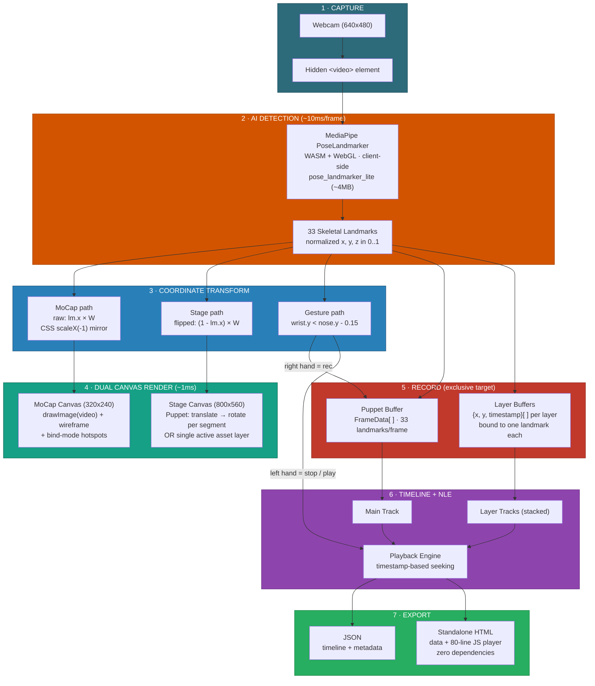
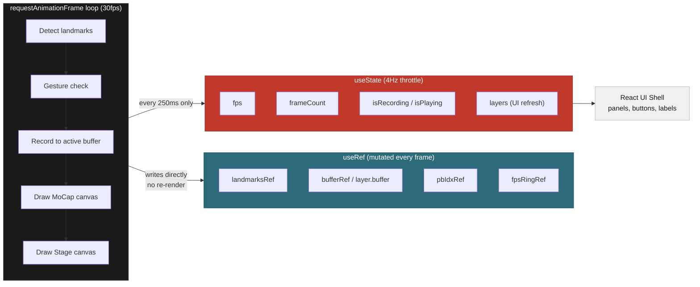
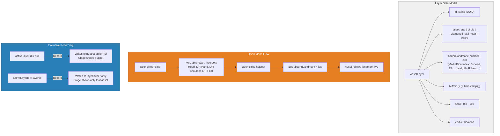

# PuppetMaster — Technical Architecture

---

## Pipeline Diagram

---

## Performance Architecture

**Why this matters:** React re-renders are expensive. If we used `useState` for landmark data at 30fps, React would reconcile 30 times per second — GC pressure, layout thrashing, dropped frames. By keeping all per-frame data in `useRef` and only updating React state 4 times per second for UI labels, we get native canvas performance with zero jank.

---

## Layer System Architecture

---

## Tech Stack

| Component | Technology | Why |
|-----------|-----------|-----|
| Framework | Next.js 16 (App Router, Turbopack) | Fast dev builds, SSR-safe with `"use client"` |
| Pose Detection | `@mediapipe/tasks-vision` PoseLandmarker | Single package, 2-call init, WASM from CDN |
| Model | `pose_landmarker_lite` (float16, ~4MB) | Fast load, GPU-delegated, 33 landmarks |
| Rendering | HTML5 Canvas 2D API | Direct pixel control, no DOM overhead |
| Styling | Tailwind CSS + inline styles | Rapid iteration, Flash CS3/CS4 aesthetic |
| Typography | Archivo + JetBrains Mono | Professional UI feel + debug readouts |
| State | React useRef (30fps) + useState (4Hz) | Canvas perf outside React render cycle |
| Export | Blob API + vanilla JS template | Zero-dependency portable HTML animations |

## Key Numbers

| Metric | Value |
|--------|-------|
| Landmarks per frame | 33 joints |
| Detection latency | ~10ms (GPU) |
| Dual canvas render | ~1ms |
| React re-renders | ~4/sec (throttled) |
| Gesture hold time | 4 seconds |
| Pre-record countdown | 2 seconds |
| Smoothing window | 7 frames |
| Trackable anchor points | 7 (head, hands, shoulders, feet) |
| Built-in asset shapes | 6 |
| Exported HTML player | ~80 lines JS |
| Total codebase | ~2100 lines (single file) |
